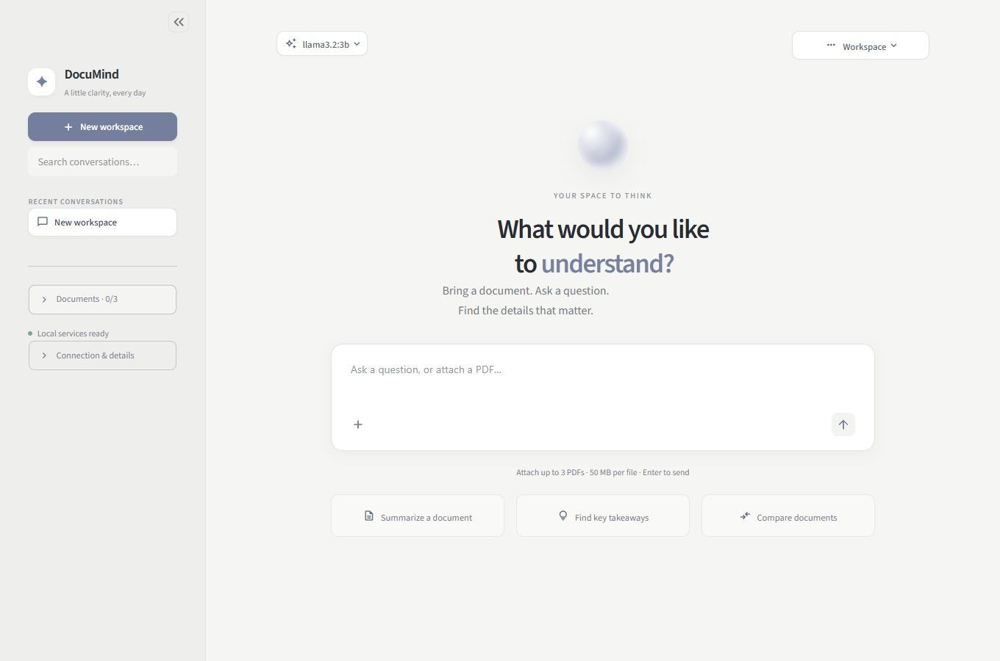
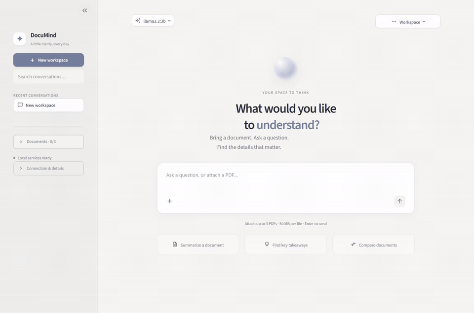
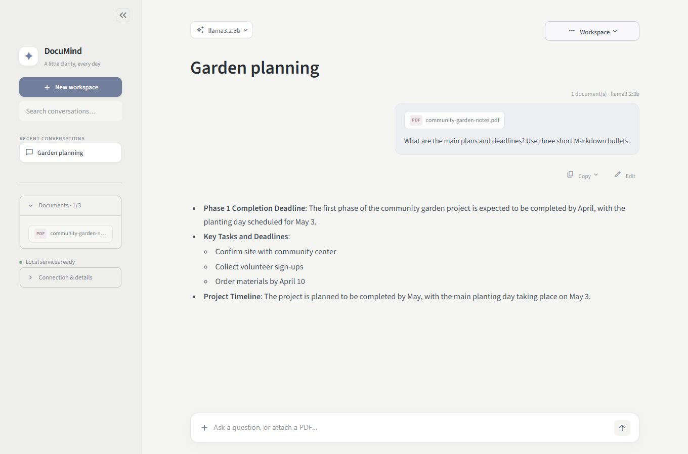

# DocuMind Local

Drop in a PDF, ask a question, and keep the conversation in one place. DocuMind can summarize documents, help you find details, and compare up to three PDFs in a workspace. You can also chat without attaching a file.

The app has a quiet gray interface, a searchable conversation list, and a model picker for switching between Ollama and an API of your choice.



## See it in action



[Watch the screen recording](docs/media/documind-demo.mp4)

The demo uses fictional community-garden notes. You can [download the same sample PDF](docs/examples/community-garden-notes.pdf) and try it yourself.



## Get started on Windows

### 1. Install these once

- [Docker Desktop](https://www.docker.com/products/docker-desktop/). Start it and wait until Docker is running.
- [Python 3.10 or newer](https://www.python.org/downloads/). Select **Add Python to PATH** during installation.
- [Ollama](https://ollama.com/download). Keep it running while you use DocuMind.

### 2. Get the project

Download and extract this repository, or clone it if you have Git:

```powershell
git clone https://github.com/ErphanRajai/DocuMind-Local.git
cd DocuMind-Local
```

### 3. Download the local models

Open PowerShell or Command Prompt and run:

```powershell
ollama pull llama3.2:3b
ollama pull nomic-embed-text
```

These models do different jobs:

| Model | What it does |
| --- | --- |
| `llama3.2:3b` | Writes answers and summaries. This is the default chat model. |
| `nomic-embed-text` | Helps the app search your documents. It does not generate chat answers. |

You can install another chat model with `ollama pull <model-name>` and select it in the app. Keep `nomic-embed-text` installed for document search.

### 4. Open DocuMind

Double-click **`Start_DocuMind.bat`** in the project folder.

The first launch creates a Python environment, installs the interface dependencies, and builds the backend. It may take a few minutes and needs an internet connection. Later launches reuse what is already installed.

DocuMind opens in a desktop window. You can also use [the browser version](http://127.0.0.1:8501). Keep the launcher window open while you work. Closing the desktop window stops the app services; in browser mode, press **Ctrl+C** in the launcher to stop them. Your saved work stays on disk.

## Your first conversation

1. Choose **New workspace** in the sidebar.
2. Use the **+** in the message box to attach a PDF. Each workspace holds up to **three PDFs**, with a **50 MB limit per file**.
3. Type a question and press **Enter**, or send the PDF on its own for a summary.
4. Ask follow-up questions in the same workspace. The attached documents stay available for that conversation.

The starter buttons fill in a suggested question. You can edit it before sending.

Use the sidebar to find earlier conversations. The **Workspace** menu lets you rename a conversation, download it as a text file, or delete its chat history. You can edit a previous question and regenerate the answer, too.

## Use your own API key

Open the model picker above the conversation, then choose **API key · OpenAI-compatible**. Enter your provider's:

- **API base URL**, such as `https://api.openai.com/v1`.
- **Model ID**.
- **API key**.

The provider must support streaming Chat Completions in the OpenAI-compatible format. Remote endpoints must use HTTPS. A compatible local server can use HTTP on a local address; from the Docker backend, use `host.docker.internal` to reach a server running on Windows.

Your key is kept in the active interface session and is not saved in conversation history. In this mode, messages and selected document text go to the provider you choose. Its usage charges and data policies apply.

Ollama and `nomic-embed-text` are still used locally to index and search PDFs, even when an API model writes the answer.

## Where your data goes

With **Local · Ollama** selected, document processing, search, and answer generation run on your computer. The initial setup downloads dependencies and models; once those are available, local conversations do not need a hosted AI API.

DocuMind saves the following in the project folder:

| Location | Contents |
| --- | --- |
| `documind_sessions.json` | Conversation titles, messages, and document references. |
| `uploaded_pdfs/` | Uploaded PDF files. |
| `db_data/` | Document records and extracted text. |
| `qdrant_storage/` | The document search index. |

These files are excluded from Git. Deleting a workspace removes its conversation history, but does not remove the stored PDF or its search data. Removing these folders manually deletes the corresponding local data, so back them up if you want to keep it.

## A few things to know

- Clear, selectable PDF text works best. The app attempts OCR on image pages with little readable text; scans can take longer and may contain reading errors.
- A long document's initial summary uses selected portions of its text. Follow-up questions search for relevant excerpts, so a summary may miss a detail elsewhere in the file.
- Answers depend on your chosen model and the text the app can extract. Check the original document when a detail matters.
- Local model speed depends on your hardware and model size. The app batches document embeddings, reuses connections, and streams answers as they arrive, but large models and scanned PDFs still need time.
- This is a workspace for your own computer. It does not include user accounts or shared multi-user access.

## If something does not start

### Docker is unavailable

Open Docker Desktop and wait until it finishes starting, then run `Start_DocuMind.bat` again.

### Ollama is unavailable or a model is missing

Open Ollama and run `ollama list` in a terminal. If either required model is missing, run the two `ollama pull` commands above. You can refresh the app's status under **Connection & details** in the sidebar.

### Every Ollama command says “timed out waiting for server to start”

Windows may have reserved Ollama's usual port, `11434`. If that is the cause, use another port:

1. In Windows user environment variables, set `OLLAMA_HOST` to `127.0.0.1:21434`.
2. Quit Ollama from its tray icon and open it again from the Start menu.
3. Copy `.env.example` to `.env` in the project folder and change `DOCUMIND_OLLAMA_PORT` to `21434`.
4. Open a new terminal, run `ollama list`, then restart DocuMind.

The port in `.env` must match the one Ollama uses. If you already have a `.env` file, edit it instead of replacing it.

### The desktop window does not open

Use [http://127.0.0.1:8501](http://127.0.0.1:8501) in your browser. The launcher also falls back to a browser if the desktop view is unavailable.

### You need the backend error details

From the project folder, run:

```powershell
docker compose logs -f pdf_backend
```

## Start it manually

Keep Docker Desktop and Ollama running. From the project folder, start the backend and document search:

```powershell
docker compose up -d --build
```

Then install and start the interface:

```powershell
python -m venv .venv
.venv\Scripts\python.exe -m pip install -r pdf-summarizer-frontend\requirements.txt
.venv\Scripts\python.exe -m streamlit run pdf-summarizer-frontend\app.py --server.address 127.0.0.1 --server.port 8501
```

Open [http://127.0.0.1:8501](http://127.0.0.1:8501). When finished, press **Ctrl+C** in the interface terminal and run `docker compose down` to stop the backend and search service.

## Inside the project

- **Streamlit** handles the interface.
- **FastAPI** handles uploads, document processing, and streamed responses.
- **Ollama** runs local chat and embedding models.
- **Qdrant** combines semantic search with keyword search for document questions.
- **SQLite** stores document records; **PyMuPDF** and **Tesseract** extract PDF text.

The frontend is in `pdf-summarizer-frontend/`, the API is in `pdf-summarizer-backend/app/`, and `launcher.py` brings the local services together.
